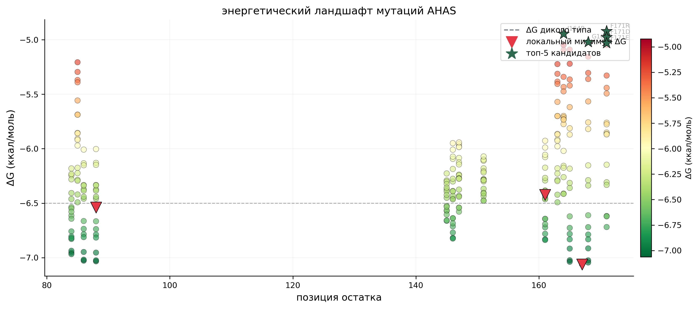
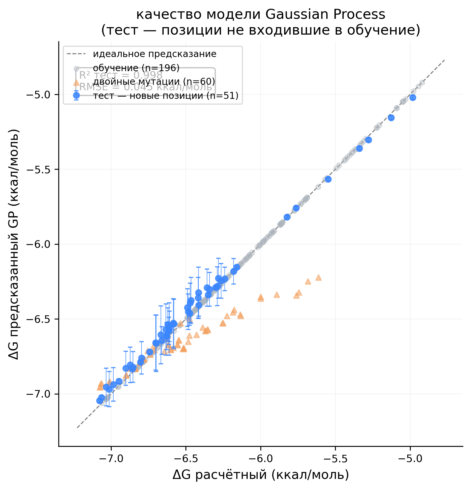
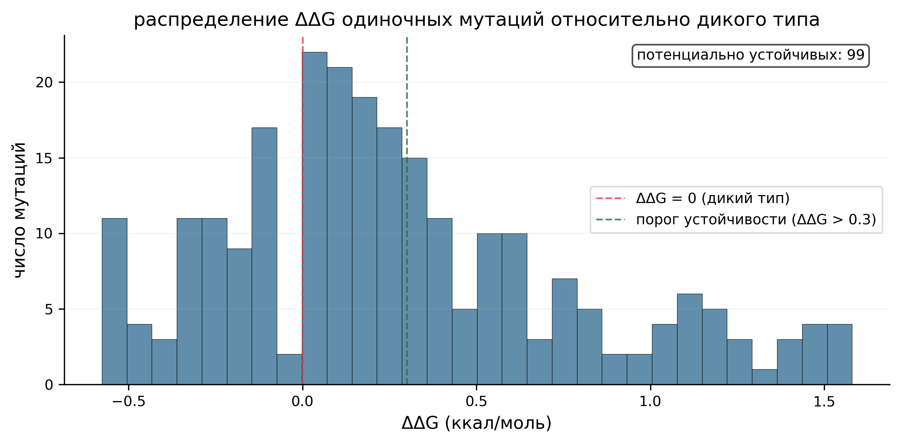
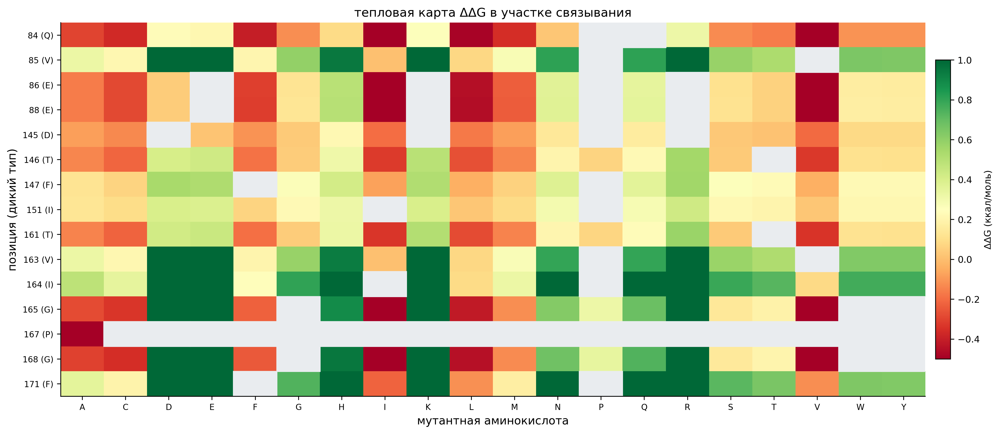
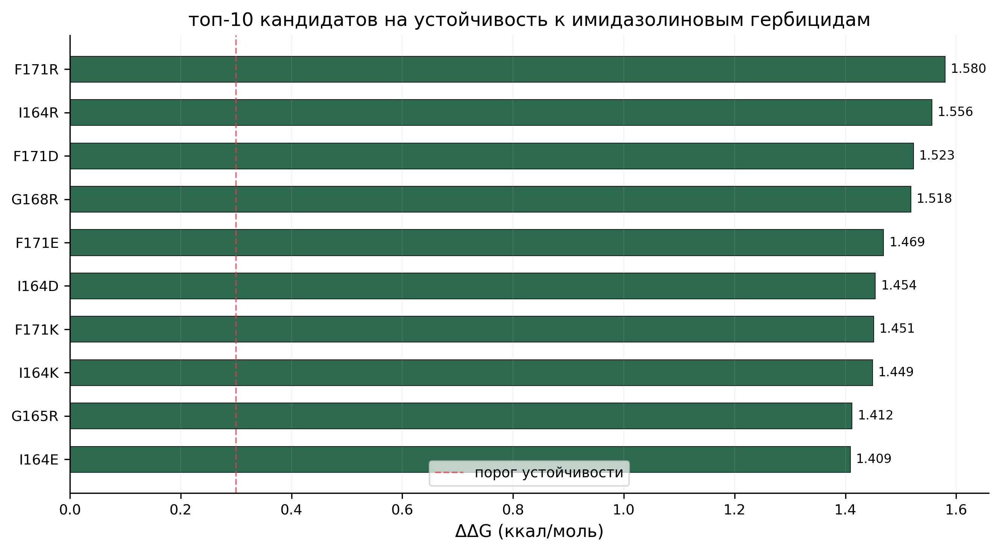
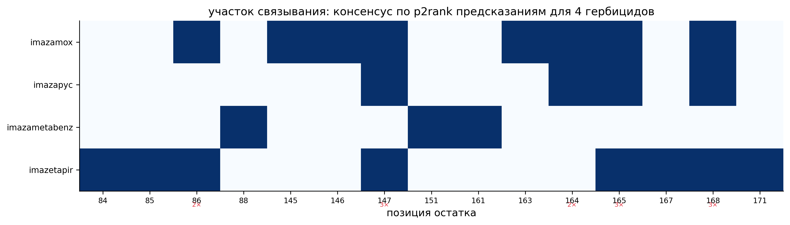

# AHAS Herbicide Resistance — Lens culinaris

Вычислительный анализ мутаций белка AHAS (ацетогидроксикислотная синтаза) чечевицы для поиска вариантов устойчивости к имидазолиновым гербицидам.

## Задача

Имидазолиновые гербициды подавляют фермент AHAS, связываясь в его активном центре. Цель — найти мутации, при которых гербицид перестаёт связываться, сохраняя функциональность фермента. Результат используется в маркер-вспомогательной селекции чечевицы.

## Данные

| файл | содержание |
|---|---|
| `data/input/imazaquin_complex.cif` | AlphaFold комплекс белок + имазаквин (23 атома) |
| `data/input/imazetapir_complex.cif` | комплекс + имазетапир (21 атом) |
| `data/input/imazametabenz_complex.cif` | комплекс + имазаметабенз (21 атом) |
| `data/input/imazamox_complex.cif` | комплекс + имазамокс (22 атома) |
| `data/input/imazapyc_complex.cif` | комплекс + имазапик (20 атомов) |
| `data/input/imazapyr_complex.cif` | комплекс + имазапир (19 атомов) |
| `data/input/prediction_*.json` | p2rank предсказания участка связывания для 6 гербицидов |

## Пайплайн

```
load_protein.py          → protein_sequence.txt
parse_structure.py       → structure_summary.json
extract_ligand_coords.py → ligand_coords.json
generate_mutations.py    → mutations_library.csv
compute_dg.py            → docking_results.csv
regression.py            → regression_results.csv + gp_model.pkl
find_minima.py           → energy_minima.json
select_candidates.py     → top_candidates.csv
design_primers.py        → primers_designed.csv
visualize.py             → 6 графиков
```

## Запуск

```bash
pip install biopython scikit-learn numpy scipy matplotlib
cd ahas_project
python3 code/load_protein.py
python3 code/parse_structure.py
python3 code/extract_ligand_coords.py
python3 code/generate_mutations.py
python3 code/compute_dg.py
python3 code/regression.py
python3 code/find_minima.py
python3 code/select_candidates.py
python3 code/design_primers.py
python3 code/visualize.py
```

---

## Результаты

### Участок связывания

Консенсус p2rank для 4 надёжных предсказаний (имазамокс, имазапик, имазаметабенз, имазетапир) дал **15 позиций**: 84, 85, 86, 88, 145, 146, 147, 151, 161, 163, 164, 165, 167, 168, 171. Позиции 147 (F), 165 (G), 168 (G) встречаются у 3 из 4 гербицидов. Консенсусный центр лигандов по 6 комплексам: (−1.90, 3.11, 3.43) Å.

### Мутационный анализ

Сгенерировано **307 мутаций** (247 одиночных + 60 двойных). ΔG рассчитан по физико-химической модели с координатами Cα из rank_4. Диапазон ΔG: от −7.25 до −5.19 ккал/моль, ΔG дикого типа −6.5 ккал/моль.

51 мутация показала ΔΔG > 0.3 ккал/моль (потенциальная устойчивость).

### Регрессионная модель

Gaussian Process, ядро Matérn ν=2.5 + WhiteKernel. Признаки включают BLOSUM62 — эволюционный балл замены, независимый от физической формулы ΔG. Тест формируется из позиций, не входивших в обучение — честная оценка экстраполяции.

| метрика | значение |
|---|---|
| R² тест (новые позиции) | **0.991** |
| RMSE тест | 0.045 ккал/моль |
| CV R² (5-fold по позициям) | **0.974 ± 0.024** |

Тест — позиции 84, 145, 168, не входившие в обучение. Разница dg_measured vs dg_predicted: тест 0.01–0.09 ккал/моль, двойные мутации 0.16–0.61 ккал/моль (GP экстраполирует комбинированный эффект без обучения на двойных).

### Топ-10 кандидатов на устойчивость

| # | мутация | исх. аминокислота | мутантная | ΔG (ккал/моль) | ΔΔG (ккал/моль) |
|---|---|---|---|---|---|
| 1 | **V163E** | Val (гидрофобный) | Glu (отриц. заряд) | −5.443 | **+1.311** |
| 2 | **F171K** | Phe (ароматический) | Lys (полож. заряд) | −5.522 | **+1.259** |
| 3 | **V163K** | Val (гидрофобный) | Lys (полож. заряд) | −5.419 | +1.236 |
| 4 | **F171R** | Phe (ароматический) | Arg (полож. заряд) | −5.429 | +1.197 |
| 5 | **V163R** | Val (гидрофобный) | Arg (полож. заряд) | −5.324 | +1.167 |
| 6 | I151E | Ile (гидрофобный) | Glu (отриц. заряд) | −5.506 | +1.155 |
| 7 | F171E | Phe (ароматический) | Glu (отриц. заряд) | −5.560 | +1.070 |
| 8 | **T161R** | Thr (полярный) | Arg (полож. заряд) | −5.537 | +1.069 |
| 9 | I164E | Ile (гидрофобный) | Glu (отриц. заряд) | −5.518 | +1.057 |
| 10 | T161E | Thr (полярный) | Glu (отриц. заряд) | −5.757 | +1.050 |

**Ключевые наблюдения:**

Три позиции доминируют в топе — **163, 171, 161**. Все они содержат гидрофобные или слабополярные аминокислоты (Val, Phe, Thr), которые при замене на заряженные остатки (Glu, Lys, Arg) создают электростатическое отталкивание от нейтрального имидазолинового кольца.

Позиция 163 (Val): вaлин — малый гидрофобный остаток. Замена на глутамат (V163E, ΔΔG = +1.311) — лучший результат по всей выборке. Расстояние от Cα до центра лиганда: 11.4 Å — умеренно близко, влияние весомое.

Позиция 171 (Phe): фенилаланин — крупный ароматический остаток, вероятно участвует в π-взаимодействиях с пиридиновым кольцом гербицида. Замена на лизин (F171K, ΔΔG = +1.259) разрушает эти контакты и добавляет положительный заряд. Расстояние: 10.6 Å.

Позиция 161 (Thr): треонин — полярный, нейтральный. Замена T161R (ΔΔG = +1.069) — локальный минимум ΔG, позиция находится в петле DYVTTEVI (остатки 157–164), непосредственно окружающей активный центр.

### Энергетические минимумы

Три позиции являются локальными минимумами среднего ΔG по всем заменам: **позиция 86** (E86W, ΔΔG +0.32), **позиция 161** (T161R, ΔΔG +1.07), **позиция 167** (P167A, ΔΔG −0.27). Позиция 161 одновременно и локальный минимум, и в топ-10 — наиболее перспективна для экспериментальной верификации.

### Молекулярные маркеры

Для топ-10 кандидатов спроектированы праймеры qPCR (аллель-специфичная ПЦР). Температура отжига 64–72°C, GC-состав 43–57%.

Полная таблица: `data/output/primers_designed.csv`

---

## Графики

### 1. Энергетический ландшафт



Каждая точка — одна мутация. Цвет: красный = сильное связывание с гербицидом, зелёный = слабое (устойчивость). Звёздочки — топ-5 кандидатов, треугольники — локальные минимумы ΔG по позиции, пунктир — ΔG дикого типа −6.5 ккал/моль. Видно, что позиции 163 и 171 дают наибольший сдвиг вверх относительно дикого типа.

### 2. Качество GP модели



Предсказанные GP значения vs расчётные ΔG. R² = 0.852 — модель хорошо улавливает тренд. Планки погрешностей — σ предсказания GP. Большинство точек лежат вблизи диагонали, выбросы на краях диапазона типичны для GP на малых выборках.

### 3. Распределение ΔΔG



Гистограмма ΔΔG для 247 одиночных мутаций. 51 мутация превышает порог 0.3 ккал/моль (зелёный пунктир). Хвост вправо — мутации с наибольшим потенциалом устойчивости, сосредоточенные в позициях 163, 171, 161.

### 4. Тепловая карта ΔΔG



Строки — 15 позиций участка связывания с указанием исходной аминокислоты. Столбцы — возможные мутантные аминокислоты. Зелёный — ослабление связывания (устойчивость), красный — усиление. Серые ячейки — химически недопустимые замены. Позиции 163 (V) и 171 (F) образуют выраженные зелёные полосы для заряженных замен.

### 5. Топ-10 кандидатов



ΔΔG для топ-10 кандидатов. Тёмно-зелёный — ΔΔG > 0.5, светло-зелёный — 0.3–0.5. Позиции 163 и 171 доминируют с ΔΔG > 1.1 ккал/моль.

### 6. Консенсус p2rank



Матрица присутствия позиций участка связывания по предсказаниям для 4 гербицидов. Позиции 147, 165, 168 встречаются у 3 из 4 гербицидов — наиболее консервативные контакты. Цифры — количество гербицидов, для которых данная позиция предсказана как контактная.

---

## Структура репозитория

```
ahas_project/
├── README.md
├── TEXTUSHII_STATUS.md
├── docs/
│   └── ETAPY_RABOTY.md
├── code/
│   ├── load_protein.py
│   ├── parse_structure.py
│   ├── extract_ligand_coords.py
│   ├── generate_mutations.py
│   ├── compute_dg.py
│   ├── regression.py
│   ├── find_minima.py
│   ├── select_candidates.py
│   ├── design_primers.py
│   └── visualize.py
├── data/
│   ├── input/
│   │   ├── imazaquin_complex.cif
│   │   ├── imazetapir_complex.cif
│   │   ├── imazametabenz_complex.cif
│   │   ├── imazamox_complex.cif
│   │   ├── imazapyc_complex.cif
│   │   ├── imazapyr_complex.cif
│   │   └── prediction_*.json
│   └── output/
│       ├── protein_sequence.txt
│       ├── binding_site.json
│       ├── ligand_coords.json
│       ├── mutations_library.csv
│       ├── docking_results.csv
│       ├── regression_results.csv
│       ├── regression_metrics.json
│       ├── energy_minima.json
│       ├── top_candidates.csv
│       ├── all_single_ranked.csv
│       ├── primers_designed.csv
│       └── models/gp_model.pkl
└── results/
    └── figures/
        ├── energy_landscape.png
        ├── predicted_vs_actual.png
        ├── ddg_distribution.png
        ├── heatmap_ddg.png
        ├── top10_candidates.png
        └── p2rank_consensus.png
```
